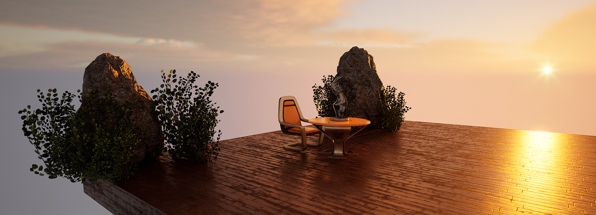

# Playground

A sandbox for experimentation with the Unreal game engine. 



## Sub-projects

The following folder hierarchy convention is to be used for sub-projects within this repo:

```txt
+-- Content
|   +-- Common
|   +-- [ProjectName]
|   |   +-- [SubProjectName]
```

where each sub-project is ideally a mostly-self-contained project that can make use of any Common assets.

## Projects

- [Unreal Engine 5 Beginner Tutorial - UE5 Starter Course!](./Content/StarterCourse/README.md)

